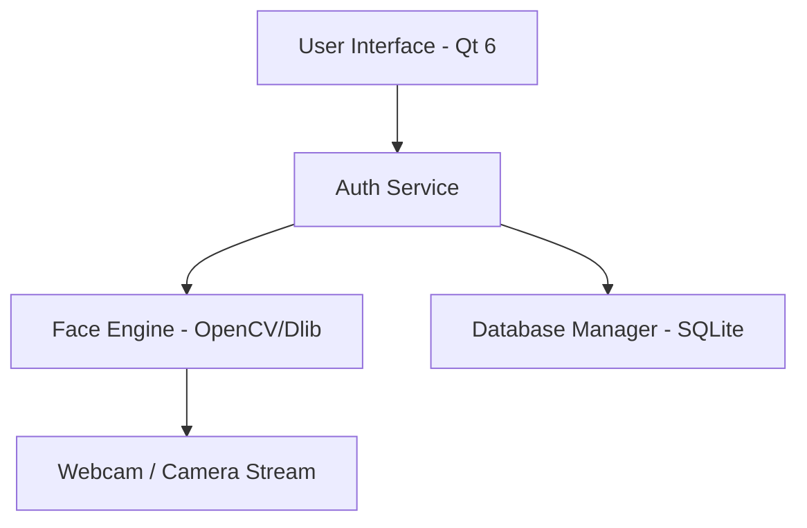
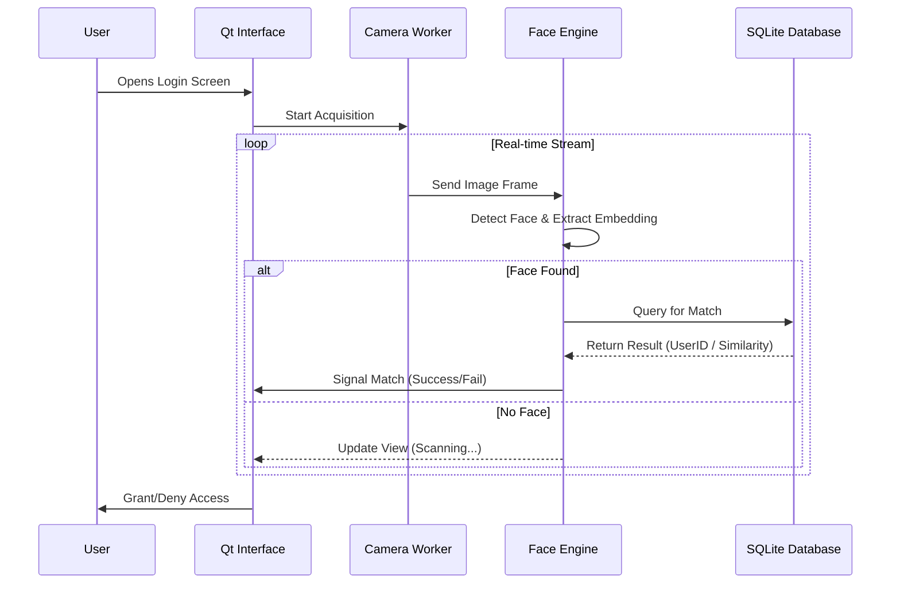
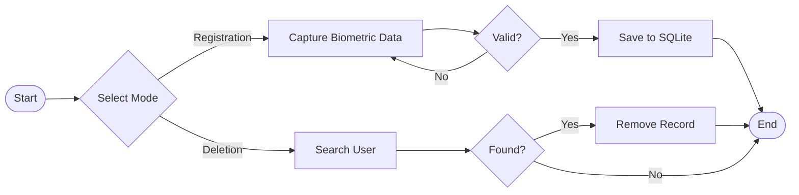

# QtFaceAuth - Arquitectura

Este documento proporciona un desglose técnico y visual del sistema QtFaceAuth.

## 1. System Overview
The system is divided into three main layers: UI, Logic (Auth/Face Engine), and Data.

## 2. Authentication Flow (Face Login)
The following sequence diagram illustrates the real-time face authentication process.

## 3. User Management (CRUD)
The logical flow for registering or deleting a user.

## 4. Component Responsibilities
| Component | Responsibility |
| :--- | :--- |
| **Qt Interface** | Hardware-accelerated GUI, user feedback, and window management. |
| **Camera Worker** | Asynchronous frame capture in a separate thread to prevent UI freezing. |
| **Face Engine** | Native C++ implementation of Dlib/OpenCV for feature extraction. |
| **Database Manager** | Securely handles user profiles and biometric signatures via QSql. |

---
*Desarrollado por asdcainicela*
