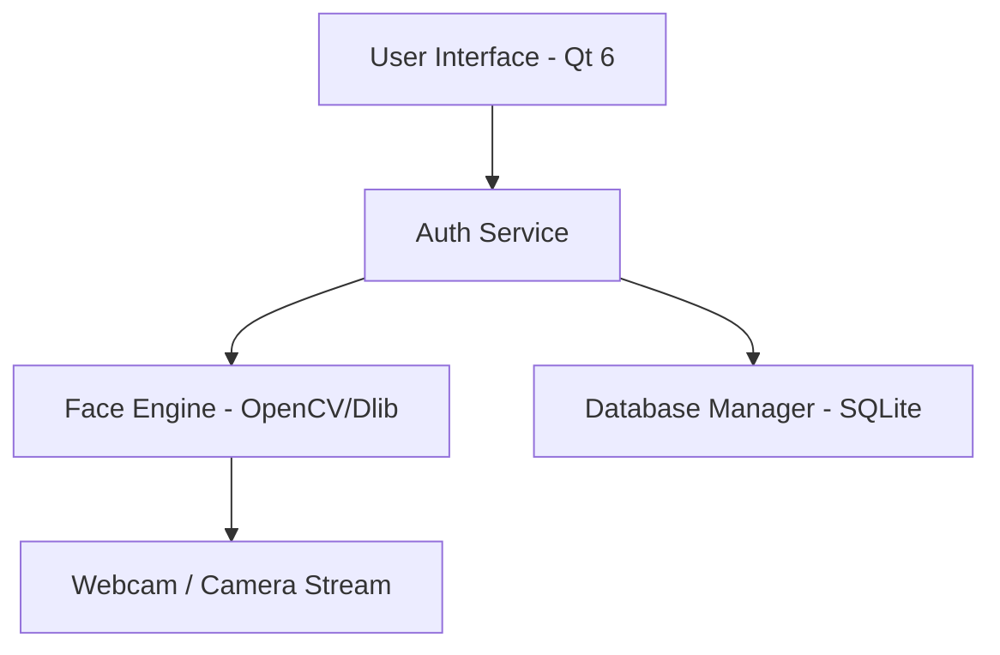
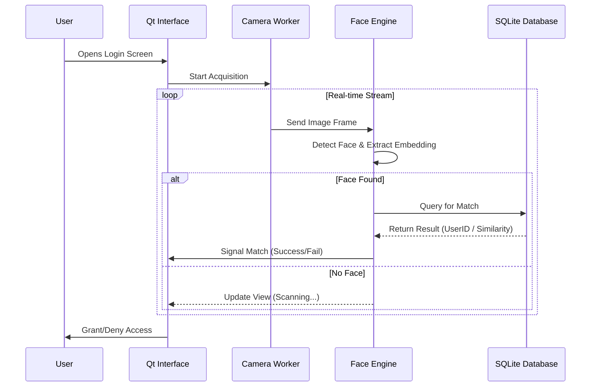
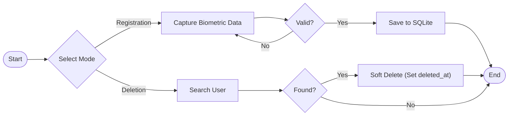

# QtFaceAuth - Arquitectura

Este documento proporciona un desglose técnico y visual del sistema QtFaceAuth.

## 1. System Overview
The system is divided into three main layers: UI, Logic (Auth/Face Engine), and Data.



## 2. Authentication Flow (Face Login)
The following sequence diagram illustrates the real-time face authentication process.



## 3. User Management (CRUD)
The logical flow for registering or deleting a user.



## 4. Component Responsibilities
| Component | Responsibility |
| :--- | :--- |
| **Qt Interface** | Hardware-accelerated GUI, user feedback, and window management. |
| **Camera Worker** | Asynchronous frame capture in a separate thread to prevent UI freezing. |
| **Face Engine** | Native C++ implementation of Dlib/OpenCV for feature extraction. |
| **Database Manager** | Securely handles user profiles and biometric signatures via QSql. |

## 5. Security & Anti-Spoofing
To ensure "military-grade" security and prevent spoofing (photo/video attacks):

### 🛡️ Liveness Detection
The system uses a **Challenge-Response** mechanism + **Optical Flow**:
1.  **Passive**: Analyze micro-movements and texture analysis (distinguish skin from paper/screen).
2.  **Active**: Require user to perform a random action (e.g., "Blink", "Turn Left", "Smile").
    *   *If the action is not detected within 2 seconds -> Access Denied.*

### 🔐 Data Encryption
-   **Keys**: Decryption keys are managed in memory and never stored in plain text alongside the database.

### 🛡️ Protection & User Guidance
To improve security and usability (ISO/IEC 30107 standard adherence):

1.  **Rate Limiting**:
    *   Max **3 failed attempts** per user/IP within 5 minutes.
    *   Following limit: 15-minute lock-out period.
    *   *Alerts*: Notify admin of potential brute-force attacks via Audit Log.

2.  **Visual Guidance (Overlay)**:
    *   **Face Frame**: A graphical overlay (green/red box) indicating correct distance and positioning.
    *   **Quality Checks**: Real-time feedback warnings:
        *   "Too Dark" / "Too Bright" (Lighting analysis)
        *   "Move Closer" / "Move Back" (Face size ratio)
        *   "Hold Still" (Blur detection)

---

## 6. Estructura del Proyecto (File System)

Organización estándar de código fuente C++ para escalabilidad y mantenimiento.

```bash
QtFaceAuth/
├── 📂 src/                  # Código Fuente (Implementación .cpp)
│   ├── main.cpp            # Punto de entrada de la aplicación
│   ├── auth/               # Lógica de autenticación y flujos
│   ├── database/           # Controladores SQL y definicion de modelos
│   ├── hardware/           # Controladores de Cámara y GPIO
│   └── utils/              # Herramientas (Loggers, Config parsers)
│
├── 📂 include/              # Cabeceras (.h) - API Pública interna
│   ├── auth/               # Interfaces de Auth
│   ├── database/           # Interfaces de DB
│   └── ...
│
├── 📂 ui/                   # Interfaz de Usuario (QML/Qt Quick)
│   ├── components/         # Botones, Cards, Inputs reutilizables
│   ├── views/              # Pantallas completas (Dashboard.qml, Users.qml)
│   ├── assets/             # Fuentes, Iconos SVG
│   └── themes/             # Archivos de estilo (Dark/Light tokens)
│
├── 📂 resources/            # Recursos binarios (qresource)
│   ├── images/             # Placeholders y logos estáticos
│   └── sounds/             # Feedback de audio (Beeps)
│
├── 📂 tests/                # Pruebas Unitarias e Integración
│   ├── unit/               # GoogleTest unitarios
│   └── integration/        # Tests de integración HW/DB
│
├── 📂 3rdparty/             # Librerías Externas
│   ├── opencv/             # Procesamiento de imagen
│   └── dlib/               # Detección facial y modelos
│
├── 📂 scripts/              # Scripts de Mantenimiento (Python)
│   ├── init_db.py          # Script para crear tablas/resetear DB
│   └── schema.sql          # SQL Raw de creación
│
├── 📂 db/                   # Base de Datos Local (Dev)
│   └── faceauth.db         # Archivo SQLite (GitIgnored)
│
├── 📂 docs/                 # Documentación del Proyecto (MkDocs)
│   ├── architecture.md     # Este archivo
│   ├── database.md         # Schema SQL
│   ├── prototypes/         # Prototipos HTML/JS vivos
│   └── ...
│
├── 📂 target/               # Binarios compilados (Salida de Build)
│   ├── debug/              # Versión de desarrollo
│   └── release/            # Versión final optimizada
│
├── CMakeLists.txt          # Configuración de Build (CMake)
└── README.md               # Introducción rápida
```

### Descripción de Módulos Clave

1.  **`src/auth/`**: Contiene el `AuthManager` que orquesta la captura de cámara, la consulta a base de datos y la decisión de acceso.
2.  **`ui/views/`**: Separa la lógica visual. `Dashboard.qml` solo sabe mostrar datos, no cómo obtenerlos (MVVM).
3.  **`database/`**: Abstracción de SQLite. Evita escribir SQL directo en la UI.
