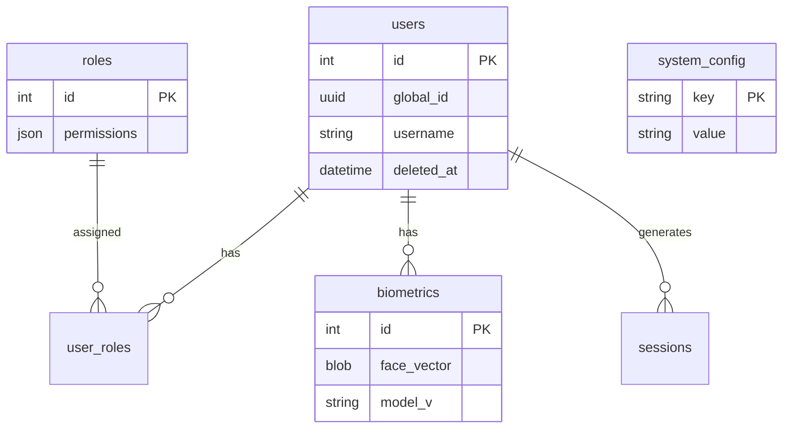

# Especificación de Base de Datos

Este documento define **la estructura final** de la base de datos para `QtFaceAuth`.
Se utiliza **SQLite 3** con modo WAL habilitado para rendimiento y concurrencia.

## 1. Implementación Física

*   **Archivo**: `faceauth.db`
*   **Driver Qt**: `QSQLITE`
*   **Ubicación**:
    *   Windows: `%APPDATA%/QtFaceAuth/db/faceauth.db`
    *   Linux: `~/.local/share/QtFaceAuth/db/faceauth.db`

---

## 2. Definición de Tablas (Schema Final)

El esquema definitivo consta de **6 tablas** para cumplir con los requisitos de seguridad y configuración.

### 2.1 Tabla: `users`
Identidad principal de los operarios y empleados.

| Columna | Tipo (SQLite) | Restricciones | Descripción |
| :--- | :--- | :--- | :--- |
| `id` | `INTEGER` | **PK**, AUTOINCREMENT | ID interno secuencial. |
| `uuid` | `TEXT` | **UNIQUE**, NOT NULL | ID Global (UUID v4) para sincronización con servidor central. |
| `username` | `TEXT` | **UNIQUE**, NOT NULL | Nombre de usuario para login manual. |
| `full_name` | `TEXT` | NOT NULL | Nombre completo para visualización en UI. |
| `password_hash` | `TEXT` | NULLABLE | Hash (Bcrypt) para acceso por teclado (backup). |
| `is_active` | `INTEGER` | DEFAULT 1 | 1 = Activo, 0 = Bloqueado. |
| `created_at` | `DATETIME` | DEFAULT CURRENT_TIMESTAMP | Fecha de alta. |
| `deleted_at` | `DATETIME` | NULLABLE | **Soft Delete**. Si tiene fecha, el usuario está borrado. |

### 2.2 Tabla: `roles`
Definición de perfiles de seguridad (RBAC).

| Columna | Tipo | Restricciones | Descripción |
| :--- | :--- | :--- | :--- |
| `id` | `INTEGER` | **PK**, AUTOINCREMENT | ID del rol. |
| `name` | `TEXT` | **UNIQUE**, NOT NULL | Ej: 'admin', 'operator', 'security'. |
| `permissions` | `TEXT` | NOT NULL | JSON con flags (ej. `{"can_export": true}`). |

### 2.3 Tabla: `user_roles`
Tabla intermedia para asignar N roles a N usuarios.

| Columna | Tipo | Restricciones | Descripción |
| :--- | :--- | :--- | :--- |
| `user_id` | `INTEGER` | **FK** -> `users.id` | CASCADE DELETE. |
| `role_id` | `INTEGER` | **FK** -> `roles.id` | CASCADE DELETE. |

### 2.4 Tabla: `biometrics`
Vectores faciales separados para permitir múltiples caras por usuario.

| Columna | Tipo | Restricciones | Descripción |
| :--- | :--- | :--- | :--- |
| `id` | `INTEGER` | **PK**, AUTOINCREMENT | ID del registro biométrico. |
| `user_id` | `INTEGER` | **FK** -> `users.id` | Dueño del vector. |
| `face_vector` | `BLOB` | NOT NULL | Array de 128 o 512 floats (serializado binario). |
| `model_version` | `TEXT` | DEFAULT 'v1' | Versión del modelo AI usado (para compatibilidad). |
| `created_at` | `DATETIME` | DEFAULT CURRENT_TIMESTAMP | Fecha de captura. |

### 2.5 Tabla: `sessions` (Access Logs)
Historial inmutable de intentos de acceso.

| Columna | Tipo | Restricciones | Descripción |
| :--- | :--- | :--- | :--- |
| `id` | `INTEGER` | **PK**, AUTOINCREMENT | ID del evento. |
| `user_id` | `INTEGER` | **FK** -> `users.id` | Puede ser NULL si el usuario no fue reconocido. |
| `login_method` | `TEXT` | NOT NULL | 'FACE', 'PIN', 'RFID'. |
| `confidence` | `REAL` | NULLABLE | Nivel de confianza (0.0 - 1.0) si fue FACE. |
| `event_type` | `TEXT` | NOT NULL | 'SUCCESS', 'FAILED', 'SPOOF_ATTEMPT'. |
| `snapshot_path` | `TEXT` | NULLABLE | Ruta a la foto de evidencia en disco. |
| `created_at` | `DATETIME` | DEFAULT CURRENT_TIMESTAMP | Timestamp del evento. |

### 2.6 Tabla: `system_config`
Configuración local de la aplicación (Kiosco).

| Columna | Tipo | Restricciones | Descripción |
| :--- | :--- | :--- | :--- |
| `key` | `TEXT` | **PK** | Clave (ej: `camera_index`, `min_confidence`). |
| `value` | `TEXT` | NOT NULL | Valor de configuración. |
| `group` | `TEXT` | DEFAULT 'general' | Agrupación para UI (General, Hardware, Network). |

---

## 3. Diagrama Entidad-Relación (Final)

