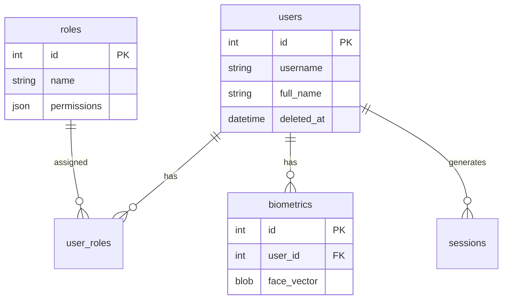

# Schema: auth

Base de datos relacional (SQLite) para gestión de usuarios, roles y datos biométricos.
Se utiliza **Soft Delete** (`deleted_at`) para mantener historial.

## Tablas

| Tabla | Descripción |
|-------|-------------|
| `users` | Usuarios registrados |
| `roles` | Definición de roles (Admin/User) |
| `user_roles` | Asignación de roles a usuarios |
| `biometrics` | Embeddings faciales de usuarios |
| `sessions` | Registro de sesiones e historial de acceso |

---

## users

Usuarios del sistema.

| Campo | Tipo | Descripción |
|-------|------|-------------|
| id | INTEGER PK | Auto-incremental |
| username | TEXT | UNIQUE |
| full_name | TEXT | Nombre completo |
| email | TEXT | Opcional |
| password_hash | TEXT | Hash (bcrypt) para login manual (backup) |
| is_active | BOOLEAN | Cuenta activa (1/0) |
| created_at | DATETIME | Fecha registro |
| updated_at | DATETIME | Última actualización |
| deleted_at | DATETIME | **Soft Delete**: Si no es NULL, el usuario está "eliminado" |

---

## roles

Roles y permisos del sistema.

| Campo | Tipo | Descripción |
|-------|------|-------------|
| id | INTEGER PK | |
| name | TEXT | 'admin', 'user', 'viewer' |
| permissions | TEXT (JSON) | Permisos específicos |

**Ejemplo Permissions (JSON):**
```json
{
  "users": {"create": true, "delete": false},
  "camera": {"access": true}
}
```

---

## user_roles

Relación Muchos-a-Muchos entre usuarios y roles.

| Campo | Tipo | Descripción |
|-------|------|-------------|
| user_id | INTEGER FK | -> users.id |
| role_id | INTEGER FK | -> roles.id |

---

## biometrics

Almacenamiento de vectores faciales (embeddings).

| Campo | Tipo | Descripción |
|-------|------|-------------|
| id | INTEGER PK | |
| user_id | INTEGER FK | -> users.id |
| face_vector | BLOB | Vector de características (float array serializado) |
| model_version | TEXT | Versión del modelo usado (ej: "dlib_resnet_v1") |
| created_at | DATETIME | Fecha de captura |

---

## sessions

Historial de accesos y sesiones.

| Campo | Tipo | Descripción |
|-------|------|-------------|
| id | INTEGER PK | |
| user_id | INTEGER FK | -> users.id |
| login_method | TEXT | 'face', 'password' |
| confidence | FLOAT | Nivel de confianza (si fue por rostro) |
| ip_address | TEXT | Opcional |
| created_at | DATETIME | Fecha de inicio de sesión |
| expires_at | DATETIME | Expiración del token/sesión |

---

## Diagrama ER


