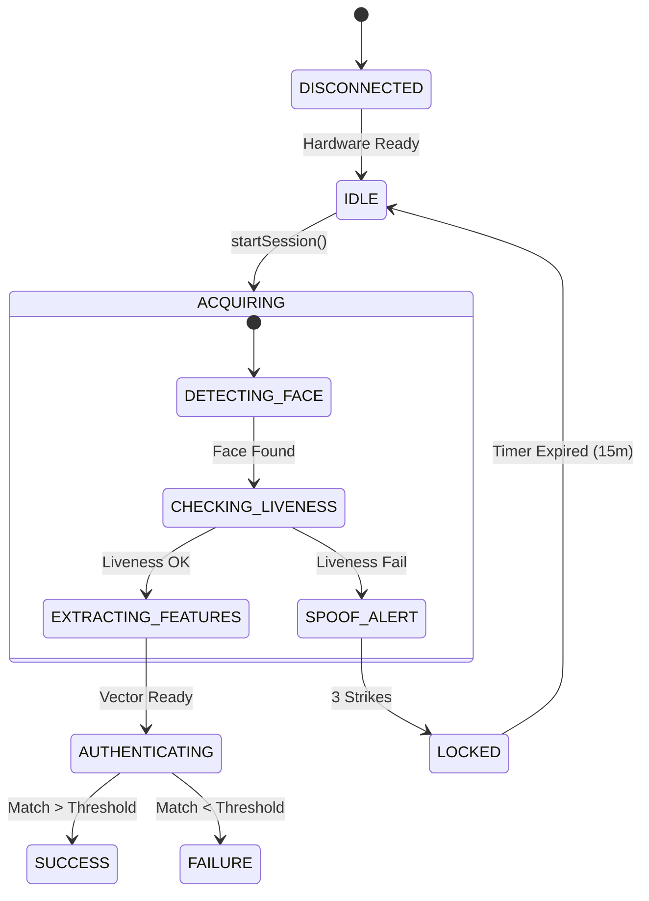

# Especificación Técnica y Contrato de API

Este documento define las interfaces programáticas, estructuras de datos y contratos de comunicación entre la capa de UI (QML) y el núcleo lógico (C++). Está diseñado para guiar al equipo de desarrollo en la implementación exacta de la arquitectura.

## 1. Arquitectura de Integración (Propiedades QML)

La comunicación se realizará mediante la clase expuesta `FaceAuthBridge`.

### 1.1 Propiedades Expuestas
| Propiedad | Tipo | Acceso | Descripción |
| :--- | :--- | :--- | :--- |
| `currentState` | `enum (State)` | Read/Notify | Estado actual de la máquina de estados (Idle, Scanning, Success, Locked). |
| `livenessChallenge` | `string` | Read/Notify | Instrucción actual para el usuario (ej. "BLINK_LEFT"). |
| `securityLevel` | `int` | Read/Write | Nivel de estrictez del umbral de coincidencia (1-5). |
| `userName` | `string` | Read | Nombre del usuario autenticado (solo en estado Success). |

### 1.2 Métodos Invocables (Q_INVOKABLE)
Métodos que la UI puede llamar directamente.

```cpp
// Inicia el ciclo de adquisición de cámara y detección
Q_INVOKABLE void startSession();

// Cancela la operación actual y resetea la máquina de estados
Q_INVOKABLE void cancelSession();

// Confirma una acción manual del usuario (si aplica)
Q_INVOKABLE void userResponse(QString actionId);
```

### 1.3 Señales (Q_SIGNAL)
Eventos asíncronos emitidos por el núcleo C++.

```cpp
// Notifica cambios en el feedback visual (ej. cara mal centrada)
void feedbackUpdated(QString message, QString colorCode);

// Alerta crítica de seguridad (Spoofing detectado)
void securityAlert(QString code, QImage evidence);

// Finalización del proceso de auth
void authFinished(bool success, QString userId, float confidence);
```

---

## 2. Estructuras de Datos (C++)

### 2.1 Definición de Usuario (`UserProfile`)
```cpp
struct UserProfile {
    QString uuid;           // ID único (UUID v4)
    QString displayName;    // Nombre visible
    QByteArray faceBlob;    // Vector biométrico encriptado (AES-256)
    int accessLevel;        // 0=Básico, 9=Admin
    QDateTime lastAccess;   // Auditoría
    bool isDeleted;         // Soft Delete flag
};
```

### 2.2 Códigos de Error Normalizados
El sistema utilizará estos códigos estándares para registro y feedback.

| Código | Mensaje Técnico | Mensaje Usuario | Acción UI |
| :--- | :--- | :--- | :--- |
| `E001` | `CAM_INIT_FAIL` | "Error de Cámara" | Mostrar icono hardware rojo. |
| `E002` | `LIVENESS_FAIL` | "Prueba Fallida" | Reiniciar ciclo con instrucción más clara. |
| `S100` | `SPOOF_DETECTED` | "Acceso Bloqueado" | **Pantalla Roja**, bloquear terminal por 60s. |

---

## 3. Máquina de Estados (Diagrama Lógico)

El backend C++ debe implementar estrictamente esta lógica para evitar condiciones de carrera.


