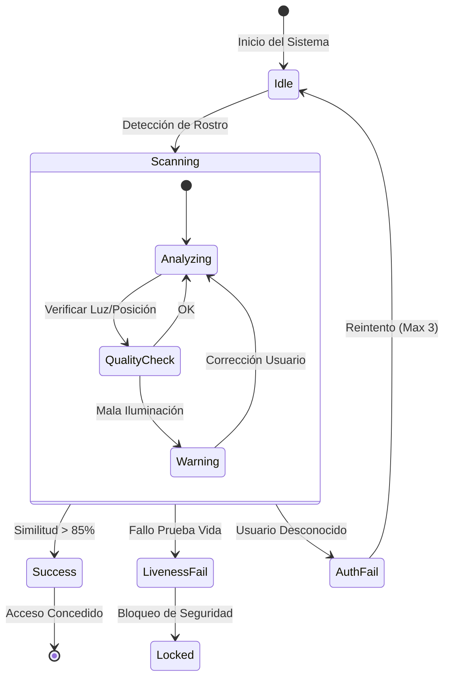

# Especificación de Interfaz de Usuario (UI/UX)

Este documento define la guía visual y el comportamiento de la interfaz. Para facilitar la implementación y revisión, los prototipos de alta fidelidad y las especificaciones responsivas se han separado en archivos HTML independientes.

## 1. Diseños Verticales (Kiosco / Tablet)

Layouts optimizados para pantallas en formato retrato (9:16).

### 1.1 Vertical Dark (Entorno Industrial)
Estilo robusto de alto contraste para kioscos de control de acceso.
<iframe src="../prototypes/hmi_vertical_dark.html" width="100%" height="600px" style="border: 1px solid #333; border-radius: 8px;"></iframe>

### 1.2 Vertical Light (Entorno Clínico)
Estilo minimalista para tablets de recepción o uso médico.
<iframe src="../prototypes/hmi_vertical_light.html" width="100%" height="600px" style="border: 1px solid #ccc; border-radius: 8px;"></iframe>

---

## 2. Diseños Horizontales (Escritorio / Widescreen)

Layouts para monitores de seguridad y estaciones de administración (16:9).

### 2.1 Horizontal Light (Oficina / SaaS)
Panel de administración con barra lateral y tema claro.
<iframe src="../prototypes/desktop_light_main.html" width="100%" height="500px" style="border: 1px solid #ccc; border-radius: 8px;"></iframe>

### 2.2 Horizontal Dark (Centro de Comando)
Panel de monitoreo en tiempo real para cuartos oscuros.
<iframe src="../prototypes/hmi_horizontal_dark.html" width="100%" height="500px" style="border: 1px solid #333; border-radius: 8px;"></iframe>

---

## 3. Menús y Navegación
Pantallas funcionales para gestión del sistema.

    

        
<strong>Gestión de Usuarios</strong>

        <iframe src="../prototypes/menu_users.html" width="100%" height="300px" style="border: 1px solid #333; border-radius: 8px;"></iframe>
    

    

        
<strong>Logs de Auditoría</strong>

        <iframe src="../prototypes/menu_logs.html" width="100%" height="300px" style="border: 1px solid #333; border-radius: 8px;"></iframe>
    

    

        
<strong>Configuración</strong>

        <iframe src="../prototypes/menu_settings.html" width="100%" height="300px" style="border: 1px solid #333; border-radius: 8px;"></iframe>
    

---

## 4. Componentes Atómicos (Live States)
Detalle de las animaciones de estado (Boot, Idle, Success).

### 1.1 Identidad de Marca (Brand)
<iframe src="../prototypes/state_brand.html" width="100%" height="200px" style="border: 1px solid #333; border-radius: 8px;"></iframe>

### 1.2 Pantalla de Carga (Boot)
<iframe src="../prototypes/state_boot.html" width="100%" height="300px" style="border: 1px solid #333; border-radius: 8px;"></iframe>

### 1.3 Estado: En Espera (Idle)

    <iframe src="../prototypes/state_idle.html" width="49%" height="300px" style="border: 1px solid #333; border-radius: 8px;"></iframe>
    <iframe src="../prototypes/state_success.html" width="49%" height="300px" style="border: 1px solid #333; border-radius: 8px;"></iframe>

### 1.4 Feedback y Anti-Spoofing

    <iframe src="../prototypes/state_feedback.html" width="32%" height="350px" style="border: 1px solid #333; border-radius: 8px;"></iframe>
    <iframe src="../prototypes/state_challenge.html" width="32%" height="350px" style="border: 1px solid #333; border-radius: 8px;"></iframe>
    <iframe src="../prototypes/state_spoof.html" width="32%" height="350px" style="border: 1px solid #333; border-radius: 8px;"></iframe>

## 2. Demo Animada (Unified Flow)
<iframe src="../prototypes/demo.html" width="100%" height="500px" style="border: 1px solid #333; border-radius: 8px; background: #000;"></iframe>

---

## 3. Especificaciones Responsivas (Technical Specs)

La interfaz debe ser **fluida y escalable**, adaptándose desde tablets industriales (10") hasta Video Walls (4k). No se deben usar coordenadas absolutas fijas.

### 3.1 Estrategia de Layout (Grid System)
*   **Header**: `height: 10vh` (10% de la altura total). Anclado al `top`.
*   **Main Viewport (Cámara)**: `flex: 1` (Ocupa todo el espacio restante).
*   **Footer/Status**: `height: 15vh`. Anclado al `bottom`.
*   **Face Frame**: Centrado en el Viewport.
    *   Tamaño: `min(40vw, 40vh)` (Escala con el lado más pequeño de la pantalla).
    *   Max Width: `600px`.

### 3.2 Registro de Componentes (Botones y Controles)

| ID Componente | Etiqueta (Label) | Tamaño Base | Comportamiento |
| :--- | :--- | :--- | :--- |
| `btn_start_auth` | "INICIAR ESCANEO" | 200px x 60px | `width: 20%` (min 150px) |
| `btn_cancel` | "CANCELAR" | 200px x 60px | `width: 20%` (min 150px) |
| `frame_biometric` | N/A | 400px x 400px | `aspect-ratio: 1:1` |
| `lbl_instruction` | "GUIÑE EL OJO..." | 24pt Font | `font-size: 2.5vh` |

### 3.3 Tipografía Escalable
*   **Fuente Principal**: `Consolas` o `Roboto Mono` (Monospaced).
*   **H1 (Títulos)**: `3.5vh`.
*   **Body**: `2.0vh`.

---

## 2. Diagrama de Flujo de Interacción
Lógica de transición de estados que debe implementar el backend.

## 3. Tokens de Diseño (Resumen)

| Token | Valor HEX | Uso |
| :--- | :--- | :--- |
| `Primary` | `#00FF00` (Neon Green) | Éxito, Liveness OK, Bordes Activos |
| `Error` | `#FF0055` (Neon Red) | Fallo, Alerta de Spoofing |
| `Background` | `#1E1E2E` | Fondo Principal |
| `Surface` | `#2E2E3E` | Paneles, Tarjetas |
