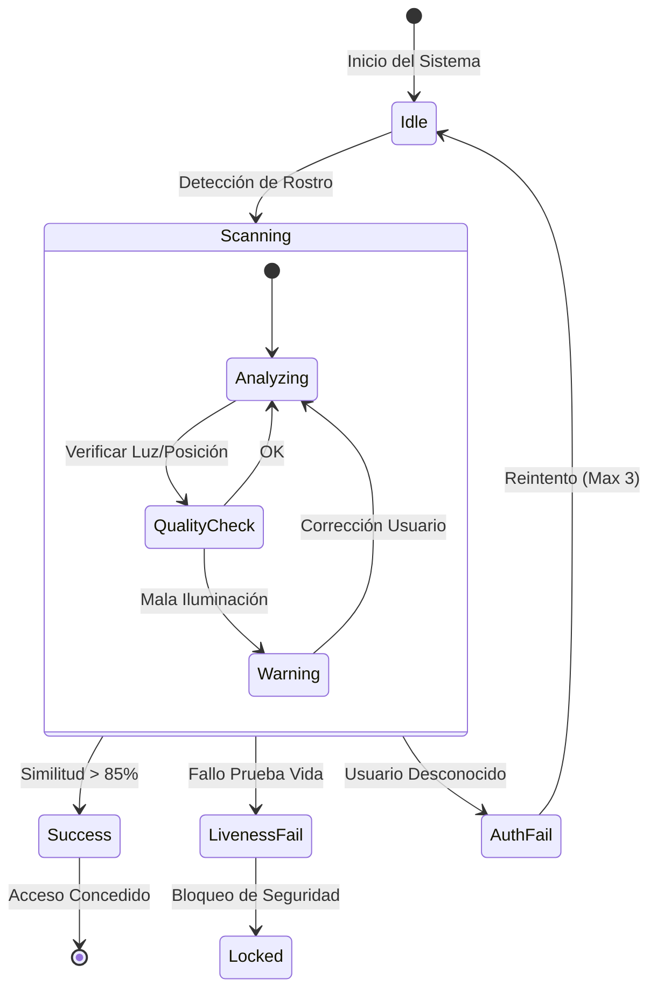

# Especificación de Interfaz de Usuario (UI/UX)

Este documento define la guía visual y el comportamiento de la interfaz. Para facilitar la implementación y revisión, los prototipos de alta fidelidad y las especificaciones responsivas se han separado en archivos HTML independientes.

## 1. Recursos de Diseño (Prototipos)

### 1.1 Tablero de Estados (Dashboard)
Visualización estática de todos los estados críticos del sistema: **Identidad de Marca, Boot Sequence, Idle, Alertas, y Detección de Spoofing**.

> [!TIP]
> **[Abrir Tablero de Diseño (Dashboard)](prototypes/dashboard.html)**  
> *Haga clic para ver los mockups en su navegador.*

### 1.2 Demo Animada (Motion Design)
Simulación del flujo completo de autenticación con animaciones CSS (Boot -> Scan -> Success).

> **[Abrir Demo Animada](prototypes/demo.html)**

### 1.3 Especificaciones Responsivas (Specs)
Reglas de escalado, sistema de grillas y registro de componentes para desarrollo.

> **[Abrir Especificaciones Técnicas](prototypes/specs.html)**

---

## 2. Diagrama de Flujo de Interacción
Lógica de transición de estados que debe implementar el backend.

## 3. Tokens de Diseño (Resumen)

| Token | Valor HEX | Uso |
| :--- | :--- | :--- |
| `Primary` | `#00FF00` (Neon Green) | Éxito, Liveness OK, Bordes Activos |
| `Error` | `#FF0055` (Neon Red) | Fallo, Alerta de Spoofing |
| `Background` | `#1E1E2E` | Fondo Principal |
| `Surface` | `#2E2E3E` | Paneles, Tarjetas |
