# Especificación de Interfaz de Usuario (UI/UX)

Este documento define la guía visual y el comportamiento de la interfaz, incluyendo prototipos funcionales renderizados directamente en el navegador.

## 1. Filosofía de Diseño
- **Estética**: "Cyber-Security" / Minimalismo Industrial.
- **Paleta de Colores**: Dark Mode obligatoria para reducir fatiga visual en centros de comando.
- **Feedback**: Respuesta visual inmediata (< 16ms) a eventos del sensor.

### 1.1 Identidad de Marca (Brand Concept)
El logotipo evoca precisión biométrica y seguridad perimetral.

    <!-- CSS Logo Construction -->
    

        

        

        
AUTH

    

    <h1 style="font-family: 'Courier New', monospace; color: white; letter-spacing: 5px; margin-top: 15px; text-transform: uppercase;">QtFaceAuth</h1>
    
SECURE ACCESS TERMINAL v1.0

## 2. Galería de Estados (Live Mockups)

A continuación se presentan las visualizaciones de los estados críticos del sistema.

### 2.0 Pantalla de Carga (Boot Sequence)
Simulación de inicialización de sistemas críticos (Hardware check).

    
> SYSTEM_INIT...

    
> CHECKING_MEMORY_INTEGRITY... [OK]

    
> LOADING_BIOMETRIC_ENGINE (DeepFace)... [OK]

    
> CONNECTING_CAMERA_DEVICE (Index 0)... [OK]

    
> VERIFYING_ENCRYPTION_KEYS (AES-256)... [LOCKED]

    
> ESTABLISHING_SECURE_TUNNEL... [DONE]

     
    
> READY_FOR_AUTH.

    

### 2.1 Estado: En Espera (Idle)
Pantalla limpia esperando presencia del usuario.

    
🛡️

    <h2 style="margin: 0;">SISTEMA DE ACCESO SEGURO</h2>
    
Solo Personal Autorizado

    <button style="background: transparent; border: 2px solid #00ff00; color: #00ff00; padding: 10px 30px; font-size: 16px; border-radius: 5px; cursor: pointer; font-weight: bold; text-transform: uppercase;">Iniciar Escaneo</button>

### 2.2 Estado: Alerta / Guía (Feedback)
El sistema detecta el rostro pero requiere corrección (mala luz, muy lejos).

    <!-- Red Frame -->
    

        
VIDEO FEED

    

    
    <!-- Warning Overlay -->
    

        
            ⚠️ MUY OSCURO - ACÉRQUESE
        
    

### 2.3 Estado: Prueba de Vida (Challenge)
Desafío aleatorio para anti-spoofing.

    <!-- Yellow Frame -->
    

        
😐 ➔ 😉

    

    
    

        <h3 style="margin: 0; text-transform: uppercase;">Prueba de Vida</h3>
        
GUIÑE EL OJO DERECHO

        

            

        

    

### 2.4 Estado: Acceso Concedido (Success)
Validación biométrica exitosa.

    

        ✓
    

    <h2 style="color: #00ff00;">ACCESO CONCEDIDO</h2>
    
Bienvenido, <strong>Oficial Anderson</strong>

    
Nivel de Seguridad: A1 | 12:45 PM

### 2.5 Estado: Ataque Detectado (Spoofing Alert)
El sistema identifica un intento de suplantación (foto o máscara).

    <!-- Siren Animation -->
    
🚨

    
🚨

    

        

    

    <h2 style="color: #ff0000; font-family: 'Impact', sans-serif; letter-spacing: 2px;">AMENAZA DETECTADA</h2>
    
SPOOFING (PRINT ATTACK)

    
Protocolo de seguridad activado. Se ha notificado a administración.

    
INCIDENT ID: #SP-99283-X

## 3. Simulación de Flujo Completo (Demo)

A continuación, una **secuencia automática** que simula el ciclo de vida completo de una autenticación exitosa.

    <!-- SCANNER EFFECT (The one you liked) -->
    

    

    <!-- STAGE 1: BOOT -->
    

        

            > SYSTEM_BOOT... 
            > CHECKING_SENSORS... [OK] 
            > LOADING_MODELS... [OK] 
            > READY.
        

    

    <!-- STAGE 2: IDLE -->
    

        

            
QtFaceAuth

            
SECURE ACCESS

            
ESPERANDO SUJETO...

        

    

    <!-- STAGE 3: SCANNING -->
    

        

        

        

        

        
        

            ANALIZANDO BIOMETRÍA... 
            CONFIDENCE: 98.4%
        

    

    <!-- STAGE 4: SUCCESS -->
    

        
✓

        <h2 style="margin: 10px 0;">ACCESO AUTORIZADO</h2>
        
BIENVENIDO, USUARIO

    

## 4. Elementos de Interfaz (UI Kit)

Componentes reutilizables diseñados para alta visibilidad.

| Componente | Estado Normal | Estado Alerta | Estado Éxito |
| :--- | :--- | :--- | :--- |
| **Marco Facial** | Color `Cyan` (Buscando) | Color `Rojo` (Error) | Color `Verde` (OK) |
| **Mensajes** | Texto Blanco | Fondo Rojo/Texto Rojo | Fondo Verde/Texto Negro |
| **Botones** | Borde `Cyan` | Deshabilitado (Gris) | Borde `Verde` |

## 4. Diagrama de Flujo de Interacción
Flujo lógico de los estados visuales que experimentará el usuario.

```mermaid
stateDiagram-v2
    [*] --> Idle: Inicio del Sistema
    Idle --> Scanning: Detección de Rostro
    
    state Scanning {
        [*] --> Analyzing
        Analyzing --> QualityCheck: Verificar Luz/Posición
        QualityCheck --> Analyzing: OK
        QualityCheck --> Warning: Mala Iluminación
        Warning --> Analyzing: Corrección Usuario
    }
    
    Scanning --> Success: Similitud > 85%
    Scanning --> LivenessFail: Fallo Prueba Vida
    Scanning --> AuthFail: Usuario Desconocido
    
    Success --> [*]: Acceso Concedido
    LivenessFail --> Locked: Bloqueo de Seguridad
    AuthFail --> Idle: Reintento (Max 3)
```

## 4. Componentes Visuales (Design Tokens)

| Token | Valor HEX | Uso |
| :--- | :--- | :--- |
| `Primary` | `#00FF00` (Neon Green) | Éxito, Liveness OK, Bordes Activos |
| `Error` | `#FF0055` (Neon Red) | Fallo, Alerta de Spoofing |
| `Background` | `#1E1E2E` | Fondo Principal |
| `Surface` | `#2E2E3E` | Paneles, Tarjetas |
| `TextPrimary` | `#FFFFFF` | Títulos, Texto Principal |
