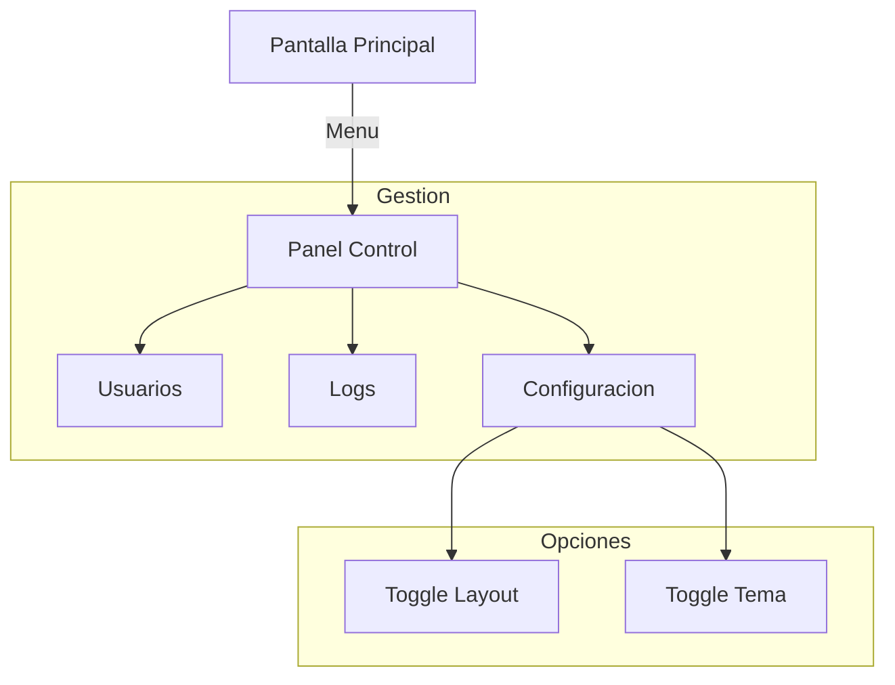

# Prototipo Interactivo (Master)

Este es el **Master Prototype**, una simulación viva de la interfaz final. Hemos unificado todas las variantes en una sola experiencia interactiva para que puedas probar la adaptabilidad del sistema en tiempo real.

!!! tip "Cómo interactuar con el demo"
    El prototipo superior es 100% funcional. Si lo abres, podrás probar:
    
    *   **🔄 Cambio de Diseño**: Alterna entre la vista de **Escritorio** (Horizontal) y **Kiosco** (Vertical).
    *   **🎨 Temas Dinámicos**: Prueba cómo se ve la interfaz en entornos oscuros (**Industrial**) vs claros (**Clínico**).
    *   **🖱️ Navegación Real**: Haz clic en el menú lateral para moverte entre el Escáner, la Base de Datos y los Logs.

    
📱 🖥️

    <h2 style="margin-top: 0; color: #fff;">Simulador de Interfaz HMI</h2>
    

        Experimente la interfaz real con transiciones fluidas entre modo <strong>Kiosco (Vertical)</strong> y <strong>Centro de Comando (Horizontal)</strong>. Incluye simulación de temas (Dark/Light) y navegación funcional.
    

    <a href="../../prototypes/master.html" target="_blank" style="background: #00ff00; color: #000; padding: 15px 40px; border-radius: 30px; text-decoration: none; font-weight: 900; font-size: 16px; display: inline-block; transition: transform 0.2s; border: 2px solid #00ff00; text-transform: uppercase; letter-spacing: 1px;">
        ▶ Abrir Demo Interactivo
    </a>
    
Se abrirá en una nueva pestaña a pantalla completa.

---

## Mapa de Navegación

El siguiente diagrama muestra la estructura lógica que se está ejecutando en el prototipo superior.

