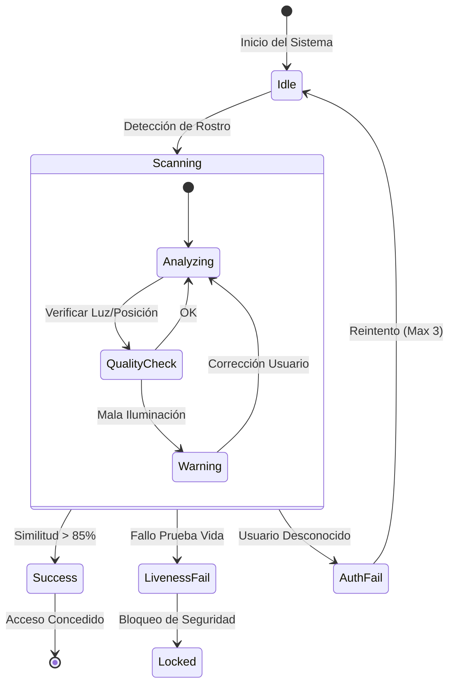

# Especificaciones y Componentes

## 1. Demo Animada (Unified Flow)
<iframe src="../../prototypes/demo.html" width="100%" height="500px" style="border: 1px solid #333; border-radius: 8px; background: #000;"></iframe>

---

## 2. Especificaciones Responsivas (Technical Specs)

La interfaz debe ser **fluida y escalable**, adaptándose desde tablets industriales (10") hasta Video Walls (4k). No se deben usar coordenadas absolutas fijas.

### 2.1 Estrategia de Layout (Grid System)
*   **Header**: `height: 10vh` (10% de la altura total). Anclado al `top`.
*   **Main Viewport (Cámara)**: `flex: 1` (Ocupa todo el espacio restante).
*   **Footer/Status**: `height: 15vh`. Anclado al `bottom`.
*   **Face Frame**: Centrado en el Viewport.
    *   Tamaño: `min(40vw, 40vh)` (Escala con el lado más pequeño de la pantalla).
    *   Max Width: `600px`.

### 2.2 Registro de Componentes

| ID Componente | Etiqueta | Tamaño Base | Comportamiento |
| :--- | :--- | :--- | :--- |
| `btn_start_auth` | "INICIAR ESCANEO" | 200px x 60px | `width: 20%` (min 150px) |
| `btn_cancel` | "CANCELAR" | 200px x 60px | `width: 20%` (min 150px) |
| `frame_biometric` | N/A | 400px x 400px | `aspect-ratio: 1:1` |

---

## 3. Diagrama de Flujo (Lógica)

## 4. Tokens de Diseño

| Token | Valor HEX | Uso |
| :--- | :--- | :--- |
| `Primary` | `#00FF00` (Neon Green) | Éxito, Liveness OK, Bordes Activos |
| `Error` | `#FF0055` (Neon Red) | Fallo, Alerta de Spoofing |
| `Surface` | `#2E2E3E` | Paneles, Tarjetas |

---

## 5. Galería de Estados de Alerta (Atomic States)

Referencia visual para estados críticos del sistema (no interactivos en el Master), útiles para styling de errores y feedback.

### 5.1 Feedback y Desafíos

    <iframe src="../../prototypes/state_feedback.html" width="32%" height="300px" style="border: 1px solid #333; border-radius: 8px;"></iframe>
    <iframe src="../../prototypes/state_challenge.html" width="32%" height="300px" style="border: 1px solid #333; border-radius: 8px;"></iframe>
    <iframe src="../../prototypes/state_spoof.html" width="32%" height="300px" style="border: 1px solid #333; border-radius: 8px;"></iframe>

### 5.2 Estado de Éxito (Access Granted)
<iframe src="../../prototypes/state_success.html" width="100%" height="200px" style="border: 1px solid #333; border-radius: 8px;"></iframe>
